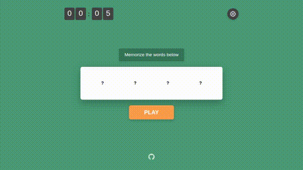
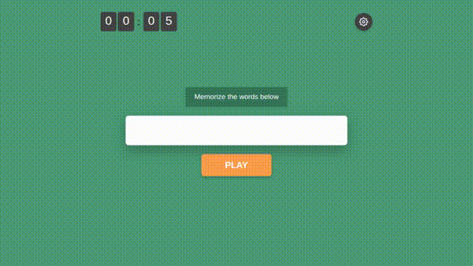

# 📹 Playwright Test Videos

This document contains automated test recordings captured by [Playwright](https://playwright.dev/) during end-to-end (E2E) testing of the Word Memory application.

---

## 🎥 Recorded Test Sessions

### 1. Initial Start Screen Test
Verifies that the timer, settings button, initial hidden target cards (`?`), status banner, and the main PLAY button load properly.



---

### 2. Full Game Lifecycle Test
Tests the complete game flow:
1. Opens settings and sets memorization duration.
2. Clicks **PLAY** to reveal target words during the countdown.
3. Transitions to the selection grid.
4. Picks words and calculates final score.
5. Displays the end game status banner and resets via **PLAY AGAIN**.


---

### 3. Game Settings Modal Test
Tests opening the settings overlay, modifying parameters (Memorization Duration, Words to Memorize, Total Grid Words), saving settings, and ensuring settings persist in `localStorage`.



---

## 🛠️ How to Re-run Tests and Update Videos

Run the Playwright test suite locally:

```bash
pnpm test
```

The test runner will execute all test cases using Playwright headless Chromium on port `26090` and automatically update the `.gif` animations under `app/tests/videos/*`.
